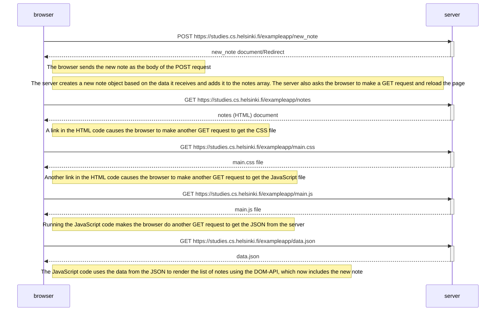

```mermaid
sequenceDiagram
    participant browser
    participant server

     browser->>server: POST https://studies.cs.helsinki.fi/exampleapp/new_note
     activate server
     server-->>browser: new_note document/Redirect
     deactivate server

     Note right of browser: The browser sends the new note as the body of the POST request

     Note left of server: The server creates a new note object based on the data it receives and adds it to the notes array. The server also asks the browser to make a GET request and reload the page

     browser->>server: GET https://studies.cs.helsinki.fi/exampleapp/notes
     activate server
     server-->>browser: notes (HTML) document
     deactivate server

     Note right of browser: A link in the HTML code causes the browser to make another GET request to get the CSS file

     browser->>server: GET https://studies.cs.helsinki.fi/exampleapp/main.css
     activate server
     server-->>browser: main.css file
     deactivate server

     Note right of browser: Another link in the HTML code causes the browser to make another GET request to get the JavaScript file

     browser->>server: GET https://studies.cs.helsinki.fi/exampleapp/main.js
     activate server
     server-->>browser: main.js file
     deactivate server

     Note right of browser: Running the JavaScript code makes the browser do another GET request to get the JSON from the server

     browser->>server: GET https://studies.cs.helsinki.fi/exampleapp/data.json
     activate server
     server-->>browser: data.json
     deactivate server

     Note right of browser: The JavaScript code uses the data from the JSON to render the list of notes using the DOM-API, which now includes the new note 
```