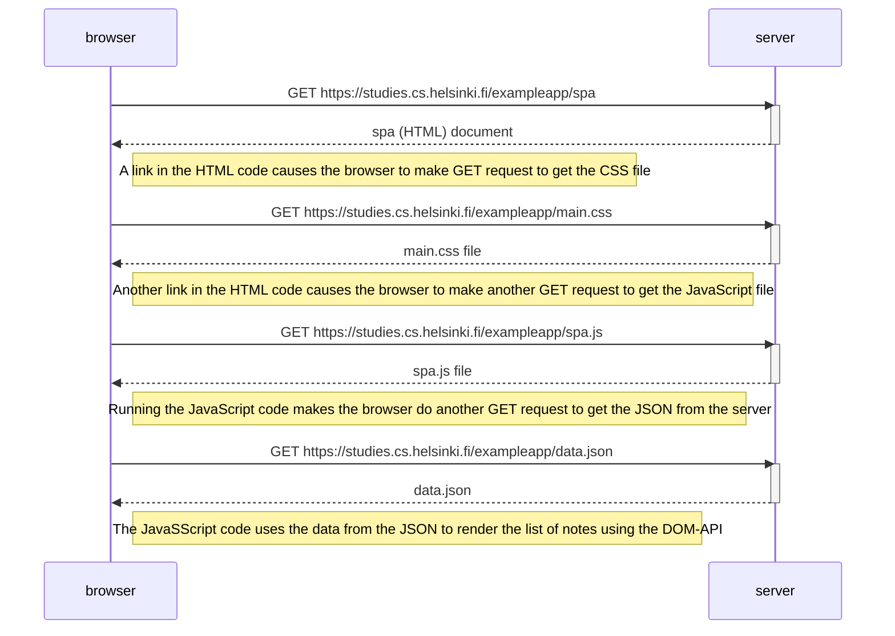

```mermaid
sequenceDiagram
    participant browser
    participant server

    browser->>server: GET https://studies.cs.helsinki.fi/exampleapp/spa
    activate server
    server-->>browser: spa (HTML) document
    deactivate server

    Note right of browser: A link in the HTML code causes the browser to make GET request to get the CSS file

    browser->>server: GET https://studies.cs.helsinki.fi/exampleapp/main.css
    activate server
    server-->>browser: main.css file
    deactivate server

    Note right of browser: Another link in the HTML code causes the browser to make another GET request to get the JavaScript file

    browser->>server: GET https://studies.cs.helsinki.fi/exampleapp/spa.js
    activate server
    server-->>browser: spa.js file
    deactivate server

    Note right of browser: Running the JavaScript code makes the browser do another GET request to get the JSON from the server

    browser->>server: GET https://studies.cs.helsinki.fi/exampleapp/data.json
    activate server
    server-->>browser: data.json
    deactivate server

    Note right of browser: The JavaSScript code uses the data from the JSON to render the list of notes using the DOM-API
```